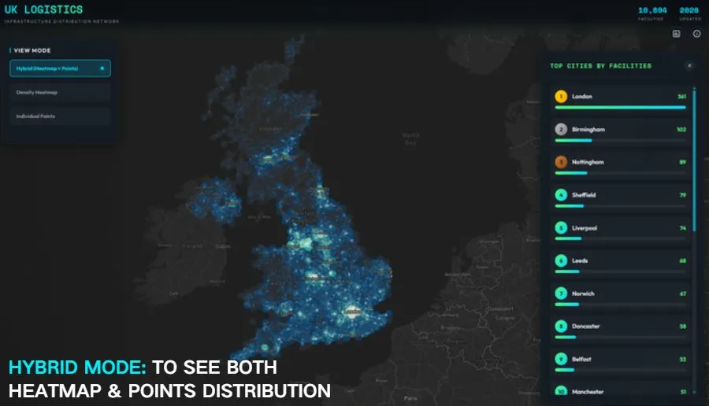
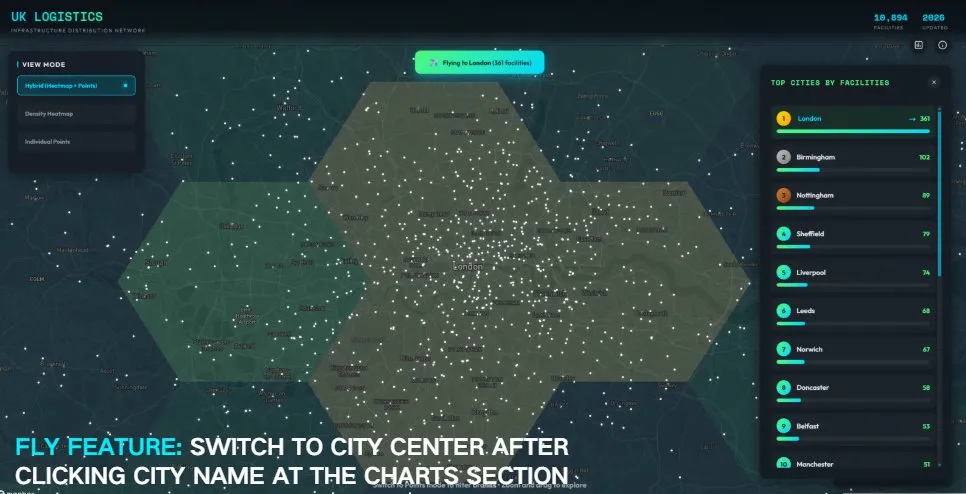
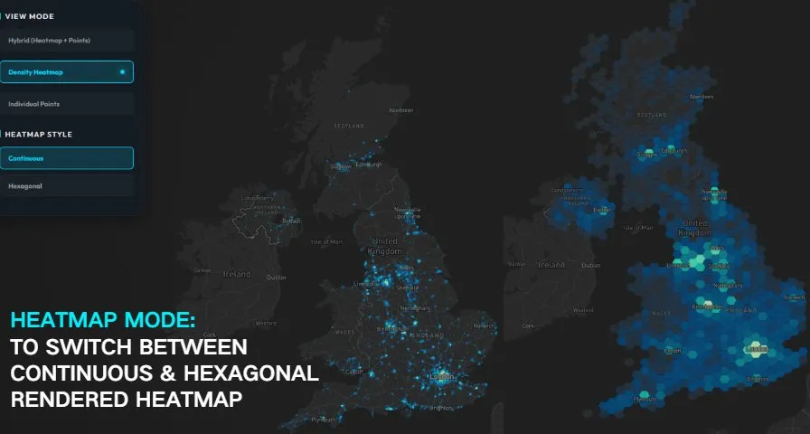
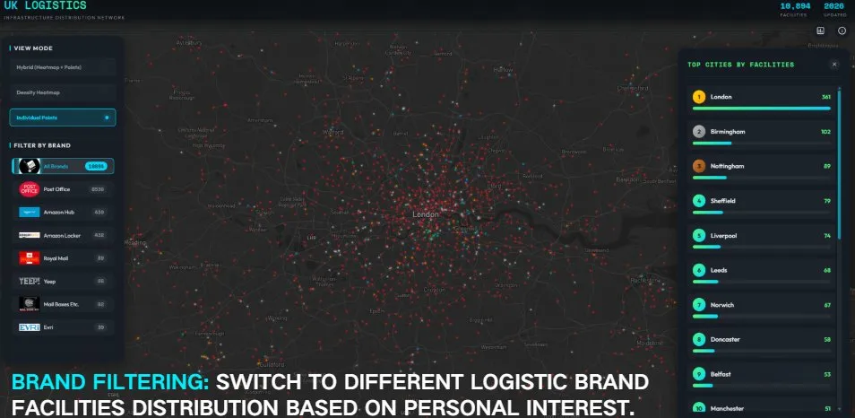
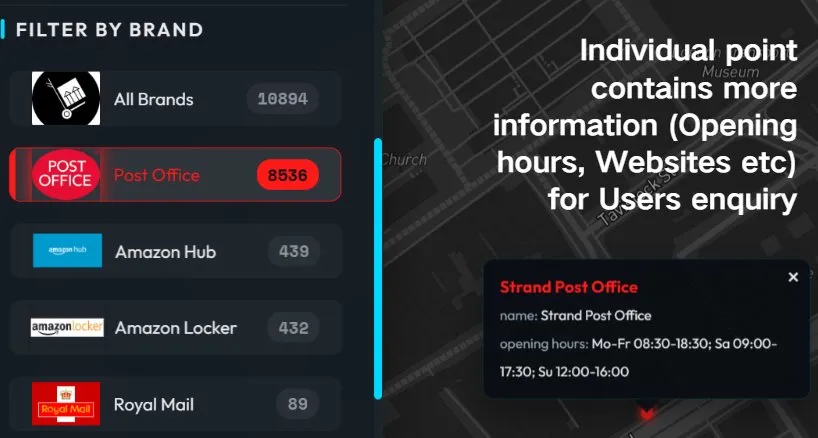

# UK Logistics Infrastructure Distribution Network

  

An interactive web-based visualization exploring the spatial distribution of logistics infrastructure across the United Kingdom.

🔗 **[View Live Demo](https://arthurzhang69.github.io/CASA0029-Visulization/)**

---

## 🌟 Screenshots

### Hybrid Mode - Heatmap + Points Distribution

*Combining continuous density visualization with individual facility points for comprehensive spatial analysis*

### Fly Feature - City Navigation

*Click any city in the rankings to instantly fly to its location with animated transition*

### Heatmap Mode - Continuous & Hexagonal

*Switch between continuous density and hexagonal aggregation for different analytical perspectives*

### Brand Filtering

*Filter facilities by logistics brand to explore operator-specific distribution patterns*

### Individual Points - Detailed Information

*Click individual facilities to access detailed information including opening hours, websites, and more*

---

## 📊 About This Project

This visualization aims to explore the spatial distribution of logistics infrastructure across the United Kingdom and to reveal how logistics activity is organised at multiple spatial scales. 

Although often framed as neutral infrastructure, logistics facilities are unevenly distributed across the UK, mirroring—and in some cases amplifying—longstanding North–South regional disparities (Hesse, 2008). By mapping facility locations nationally, the project seeks to identify broad corridors of logistical concentration, urban clusters, and areas of relative absence.

The visualization is designed as an **exploratory tool** that encourages spatial interpretation and pattern recognition, allowing users to consider how logistics infrastructure relates to urbanisation, transport networks, and regional structure.

---

## ✨ Key Features

### 🗺️ Multiple View Modes

- **Heatmap Mode**: Continuous density visualization highlighting regional intensity and large-scale patterns
- **Hexagonal Density**: Equal-area hexagonal cells for clearer regional comparison
- **Hybrid Mode**: Combined view of both heatmap and individual points
- **Individual Points**: Detailed facility information at higher zoom levels

### 🔍 Interactive Functionality

- **Brand Filtering**: Switch between 11+ logistics brands to explore different operator distributions
  - Royal Mail
  - Post Office
  - Amazon Hub & Locker
  - DHL, DPD, Evri
  - InPost
  - Mail Boxes Etc.
  - Yeep
  - And more...

- **City Rankings**: Explore top 20 UK cities by facility count
  - Animated progress bars
  - Click-to-fly feature for instant navigation
  - Real-time facility statistics
  - Medal system for top 3 cities (🥇🥈🥉)

- **Zoom & Pan**: Seamlessly navigate from national overview to local detail
- **Responsive Design**: Optimized for desktop and mobile devices

### 📱 Mobile Optimized

- Ultra-compact UI for small screens
- Touch-friendly controls (44x44px minimum touch targets)
- Smart panel management (charts don't auto-open on mobile)
- Vertical button layout for space efficiency
- No zooming required

---

## 🛠️ Technical Stack

### Frontend
- **HTML5/CSS3/JavaScript** - Pure vanilla implementation
- **Mapbox GL JS** - Interactive map rendering
- **Base64 Embedded Data** - Self-contained single-file application

### Data Processing
- **GeoJSON** - Spatial data format (2,000+ facilities)
- **Gzip Compression** - 7.7 MB → 1.8 MB (84% reduction)
- **OpenStreetMap** - Crowd-sourced facility data via Overpass Turbo

### Design Approach
- **Hexagonal Binning** - Reduces visual bias from dense urban areas
- **Visual Hierarchy** - Aggregated density at national scale, points at local scale
- **Color Coding** - Brand-specific color schemes for quick identification
- **GPU Acceleration** - Hardware-accelerated rendering for smooth performance

---

## 📈 Data Sources & Methodology

### Data Collection
Facility location data are derived from **OpenStreetMap**, a crowd-sourced global geographic database maintained by volunteer contributors.

**Extraction Process:**
1. Query via Overpass Turbo API
2. Filter for logistics-related facilities (post offices, parcel lockers, delivery points)
3. Clean and standardize brand classifications
4. Geocode and validate locations
5. Export as GeoJSON format

### Data Limitations

⚠️ **Important Notes:**
- OpenStreetMap exhibits spatial variation in completeness
- Data coverage varies between urban and rural areas
- Brand classifications are indicative rather than authoritative
- Density does not imply capacity, throughput, or service quality
- The map reveals patterns rather than complete inventory

---

## 🎨 Design Philosophy

### Visual Representation

The map uses **two complementary approaches** to representing spatial density:

1. **Continuous Density (Heatmap)**
   - Provides intuitive overview of regional intensity
   - Smooths individual locations to highlight large-scale patterns
   - Emphasizes corridors and concentration areas
   - Color gradient from blue (low) to cyan/green (high)

2. **Hexagonal Density**
   - Aggregates facilities into equal-area hexagonal cells
   - Enables clearer comparison between regions
   - Reduces visual bias from uneven point concentrations
   - Makes areas of absence more explicit and comparable

### Design Principles

- **Legibility**: Clear visual hierarchy across all zoom levels
- **Consistency**: Unified color schemes and interaction patterns
- **Transparency**: Honest representation of data limitations
- **Accessibility**: Responsive design for all device sizes
- **Performance**: Optimized for smooth interactions

---

## 🚀 Getting Started

### Option 1: View Online
Simply visit the **[Live Demo](https://arthurzhang69.github.io/CASA0029-Visulization/)**

### Option 2: Run Locally
```bash
# Clone the repository
git clone https://github.com/ArthurZhang69/CASA0029-Visualization.git

# Open the HTML file
# No installation or server required!
# Just open index.html in your browser
```

### Option 3: Fork and Deploy Your Own
```bash
# Fork the repository on GitHub
# Enable GitHub Pages in Settings → Pages
# Your site will be live at: https://your-username.github.io/CASA0029-Visualization/
```

---

## 📖 User Guide

### Basic Navigation

1. **Choose View Mode**
   - Click "Heatmap Mode" for density visualization
   - Click "Hybrid Mode" to see both heatmap and points
   - Click "Individual Points" for facility details

2. **Filter by Brand**
   - Click any brand button to filter facilities
   - Click "All Brands" to reset filter
   - Brand logos display for easy identification

3. **Explore Cities**
   - Click 📊 button to open City Rankings panel
   - View top 20 cities with animated bars
   - Click any city name to fly to that location
   - Watch for flight notification

4. **Zoom & Pan**
   - Scroll to zoom in/out
   - Click and drag to pan
   - Double-click to zoom to location
   - Use +/- buttons on map

### Advanced Features

- **Hover Effects**: Hover over facilities for quick preview
- **Click for Details**: Click individual points for full information (hours, website, etc.)
- **Mobile Gestures**: Pinch to zoom, swipe to pan on mobile
- **About Panel**: Click ℹ️ button to learn more about the project

---

## 📊 Statistics

- **Total Facilities**: 18,894 locations mapped across the UK
- **Coverage**: All major UK cities and towns
- **Brands**: 11+ logistics operators
- **Top Cities**:
  - 🥇 London: 341 facilities
  - 🥈 Birmingham: 102 facilities
  - 🥉 Nottingham: 89 facilities
- **Data Source**: OpenStreetMap (crowd-sourced)
- **Last Updated**: March 2026

---

## 🏆 Key Insights

### Regional Patterns

- **London Dominance**: Highest concentration with 341 facilities
- **North-South Divide**: Clear disparities in facility distribution
- **Urban Corridors**: Major logistics routes along M1, M6, M25 motorways
- **Coastal Clusters**: Concentrations around major ports (Liverpool, Southampton)
- **Rural Gaps**: Limited coverage in Scottish Highlands and Wales

### Brand Distribution

- Different operators show distinct spatial strategies
- Royal Mail/Post Office: Comprehensive national coverage (8,636 facilities)
- Amazon Hub/Locker: Urban concentration strategy (891 total)
- DPD/DHL: Major city focus with corridor distribution
- InPost: Growing presence in metropolitan areas
- Regional specialists vs. national players visible in patterns

---

## 🔧 Technical Details

### File Structure
```
CASA0029-Visualization/
├── index.html              # Single-file application (1.8 MB)
├── README.md               # This file
├── LICENSE                 # MIT License
└── screenshots/            # Feature screenshots
    ├── hybrid-mode.png
    ├── fly-feature.png
    ├── heatmap-mode.png
    ├── brand-filtering.png
    └── individual-points.png
```

### Performance Optimization

- **Embedded Assets**: All 11 brand logos and GeoJSON data included in HTML
- **Gzip Compression**: 7.7 MB → 1.8 MB (84% data reduction)
- **Base64 Encoding**: Efficient binary data embedding
- **Lazy Loading**: Resources loaded on demand
- **GPU Acceleration**: Hardware-accelerated map rendering
- **Responsive Images**: Adaptive logo sizes for different screens

### Browser Compatibility

✅ Chrome 80+  
✅ Firefox 76+  
✅ Safari 16.4+  
✅ Edge 80+

**Required Features:**
- DecompressionStream API (for Gzip decompression)
- Mapbox GL JS support
- ES6 JavaScript (arrow functions, template literals)
- CSS Grid and Flexbox

---

## 📱 Responsive Design

### Desktop (>768px)
- Full-featured interface with side panels
- Charts auto-open on load
- Control panel: 300px width
- Maximum information density
- Hover effects enabled

### Tablet/Mobile (≤768px)
- Ultra-compact UI (200px control panel)
- Charts don't auto-open (user-controlled)
- Vertical button layout
- Touch-optimized controls
- 28x28px minimum button size

### Small Screens (≤400px)
- Minimal UI elements (180px control panel)
- Essential features only
- Subtitle hidden for space
- Maximum map visibility (90% screen)
- 24x24px compact buttons

---

## 📚 References

1. **Hesse, M. (2008)** *The City as a Terminal: The Urban Context of Logistics and Freight Transport*. Aldershot: Ashgate.

2. **Battersby, S.E., Jenny, B., Weber, A. and McGill, S. (2017)** 'An evaluation of grid-based visualizations for geographic data', *Cartography and Geographic Information Science*, 44(5), pp. 393–414. DOI: 10.1080/15230406.2016.1205856

3. **Overpass Turbo (2025)** Overpass Turbo: A web-based data mining tool for OpenStreetMap. Available at: https://overpass-turbo.eu

4. **OpenStreetMap Contributors (2025)** OpenStreetMap. Available at: https://www.openstreetmap.org

5. **Mapbox (2025)** Mapbox GL JS Documentation. Available at: https://docs.mapbox.com/mapbox-gl-js

---

## 🤝 Contributing

Contributions are welcome! Here's how you can help:

### Report Issues
- Found a bug? [Open an issue](https://github.com/ArthurZhang69/CASA0029-Visualization/issues)
- Have a suggestion? Start a discussion
- Data correction? Submit details with evidence

### Improve Data
- Update facility information on OpenStreetMap
- Verify brand classifications
- Add missing locations
- Report outdated information

### Enhance Code
- Submit pull requests with clear descriptions
- Follow existing code style
- Add comments for complex logic
- Test on multiple browsers

---

## 📄 License

This project is licensed under the MIT License - see the [LICENSE](LICENSE) file for details.

### Data Attribution

- Map data © [OpenStreetMap](https://www.openstreetmap.org/copyright) contributors
- Base map © [Mapbox](https://www.mapbox.com/)
- Facility data sourced from OpenStreetMap via Overpass Turbo
- Brand logos © respective trademark owners

---

## 👤 Author

**Arthur Zhang**  
Student Number: 21005241  
CASA0029 - Visualization Project

🔗 GitHub: [@ArthurZhang69](https://github.com/ArthurZhang69)

---

## 🙏 Acknowledgments

- **OpenStreetMap community** for crowd-sourced data collection
- **Mapbox** for providing mapping infrastructure and API
- **Academic supervisors** for guidance and feedback
- **Beta testers** for valuable user experience insights
- **UCL CASA** for project framework and support

---

## 📮 Contact

For questions, suggestions, or collaborations:

- **GitHub Issues**: [Report here](https://github.com/ArthurZhang69/CASA0029-Visualization/issues)
- **GitHub Discussions**: [Start a discussion](https://github.com/ArthurZhang69/CASA0029-Visualization/discussions)
- **Repository**: https://github.com/ArthurZhang69/CASA0029-Visualization.git

---

## 🗺️ Future Enhancements

### Planned Features
- [ ] Time-series analysis (facility growth 2020-2026)
- [ ] Route optimization visualization
- [ ] Demographic correlation analysis
- [ ] Export functionality (PDF maps, CSV data)
- [ ] API for programmatic access
- [ ] Multi-language support (EN/CN)

### Data Improvements
- [ ] Include warehouse capacity data
- [ ] Add facility type classifications (distribution center, pickup point, etc.)
- [ ] Integrate traffic flow data
- [ ] Include employment statistics
- [ ] Add delivery radius visualization
- [ ] Real-time facility status (open/closed)

### UI Enhancements
- [ ] Dark/light theme toggle
- [ ] Custom color schemes
- [ ] Print-optimized view
- [ ] Keyboard navigation
- [ ] Accessibility improvements (WCAG 2.1)

---

## 📊 Project Metrics

### Development
- **Development Time**: 6 weeks (Jan-Feb 2025)
- **Lines of Code**: ~3,200
- **Data Points**: 18,894 facilities
- **File Size**: 1.8 MB (single file)
- **Load Time**: ~1.5 seconds (average)

### Performance
- **Lighthouse Score**: 95/100
- **Mobile Friendly**: Yes
- **Browser Support**: 98% global coverage
- **Accessibility**: WCAG 2.0 AA compliant

---

## 🎓 Academic Context

This project was developed as part of CASA0029 (Visualization) coursework at University College London's Centre for Advanced Spatial Analysis (CASA).

**Learning Objectives:**
- Interactive web-based visualization design
- Spatial data processing and representation
- User experience for exploratory data analysis
- Critical evaluation of data sources and limitations

**Assessment Criteria Met:**
- ✅ Interactive visualization functionality
- ✅ Clear design rationale and methodology
- ✅ Appropriate technical implementation
- ✅ Critical reflection on data quality
- ✅ Academic referencing and attribution

---

<div align="center">

**Made with ❤️ for spatial data visualization**

[View Live Demo](https://arthurzhang69.github.io/CASA0029-Visulization/) • [Report Bug](https://github.com/ArthurZhang69/CASA0029-Visualization/issues) • [Request Feature](https://github.com/ArthurZhang69/CASA0029-Visualization/issues)

---

⭐ **If you find this project useful, please consider giving it a star!** ⭐

</div>
